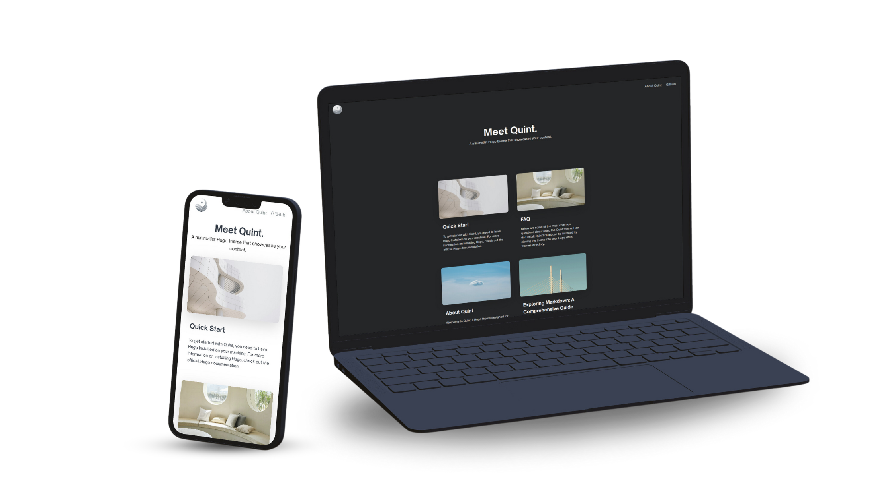

# Quint: Essence of Minimalism



Quint is a minimalist Hugo theme designed to evoke a clean, airy feel, emphasizing clarity and ease of reading. It features elegant built-in image banners and a lightweight design, making it ideal for displaying your content center stage.

Check out the [demo site](https://quint-theme-demo.netlify.app/), which you can also use as a starter template for a new site. (Psst... there's a one-click deploy to Netlify button there.)

## Features

- **Minimalist Design**: Focused on content readability with minimal distractions.
- **Dark and Light Modes**: Automatic theme switching that respects the viewer's browser/device settings.
- **Responsive Layout**: Looks great on both mobile and desktop devices.
- **Included Image Banners**: Ships with beautiful minimalist image banners that set the tone for your site. Replace them or add your own anytime.
- **Site Search**: Built-in search on your static site using Lunr.js.
- **Social Icons**: Configurable links to your social media in the footer.

## Quick Start

To get started with Quint, you need to have Hugo installed on your machine. For more information on installing Hugo, check out the [official Hugo documentation](https://gohugo.io/getting-started/installing/).

For a step-by-step guide to creating a new site with Hugo, read the [Quick start](https://gohugo.io/getting-started/quick-start/).

### Step 1: Install the Theme

With Hugo installed, add Quint to your site's themes directory. From your site root, run:

```bash
git submodule add https://github.com/victoriadrake/hugo-theme-quint.git themes/quint
```

### Step 2: Add the Theme to Your Configuration

Open your Hugo site's configuration file (either `hugo.toml`, `hugo.yaml`, or `hugo.json`) and update the `theme` parameter to use `quint`:

#### For `hugo.toml`:

```toml
theme = "quint"
```

#### For `hugo.yaml`:

```yaml
theme: "quint"
```

### Step 3: Configure

Quint looks great out-of-the-box. Optionally, copy configuration values from `yoursite/themes/quint/hugo.toml` to your site's configuration (`yoursite/hugo.toml`) to personalize Quint further.

### Step 4: Run the Server

Run Hugo to generate your site and start up the server. From your site root, run:

```bash
hugo server
```

Navigate to `http://localhost:1313` in your web browser to see your site in action with the Quint theme.

### Get Updates

To download the latest version of Quint, run:

```bash
git submodule update --remote themes/quint
```

## Customizing

Quint is designed to be simple to customize. Add your own custom CSS files easily by naming them in your Hugo config:

```toml
[params]
css = ["css/custom.css"] # Your custom CSS overrides, stored in yoursite/static/
```

You can override any layout or style using a file of the same name in your project directory. For example, the file `yoursite/static/css/styles.css` will override `yoursite/themes/quint/static/css/styles.css`.

### Image Banners

If a page or post does not specify an `image` in the front matter, Quint will display a beautiful image banner by choosing a random image from the directory `themes/quint/static/images`.

This is accomplished by choosing a random number from 1-10, which corresponds to an image filename. You can add to this collection or replace any image you wish. Just update the maximum random number to match the number of images you have.

```toml
[params]
numImages = 12  # Number of random images to choose from for banners (in themes/quint/static/images)
```

## Contributing

Contributions to Quint are welcome! Feel free to submit issues or pull requests [on GitHub](https://github.com/victoriadrake/hugo-theme-quint) to improve the theme's functionality or documentation.

Want some ideas to get started? Here's a quick list of features I'd love to see added:

- [ ] Code block copy buttons
- [ ] Hugo's Chroma syntax highlighting
- [ ] Hugo's asset generator with pipelining, fingerprinting, bundling and minification
- [ ] Multilingual support
- [ ] Breadcrumb navigation

## License

This theme is released under the MIT License. For more details, see the LICENSE file.

## Attribution

- Quint uses the excellent [Open Sauce Font](https://github.com/marcologous/Open-Sauce-Fonts).
- Device mockup created from [deviceframes.com](https://deviceframes.com/templates/iphone-13).
